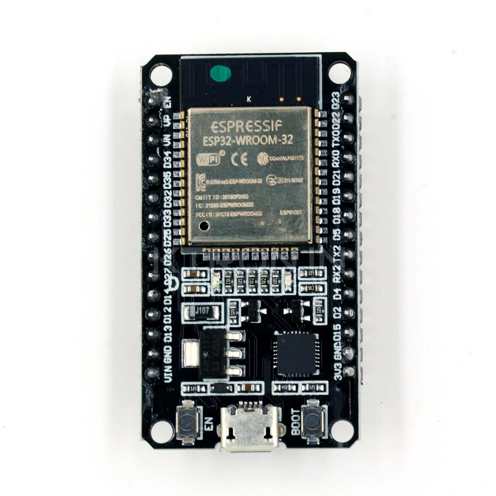
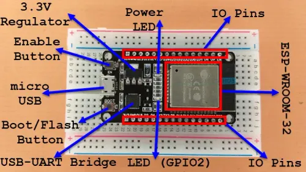

# BT_HID_Attack_Using-ESP32
The ESP32 is a small, inexpensive, and powerful microcontroller chip made by Espressif Systems. It’s super popular for electronics projects, IoT devices, and hobby experiments.



## **What the ESP32 Can Do**

The ESP32 includes:

- **Wi‑Fi** (connect to networks or create your own)
- **Bluetooth + BLE** (connect to phones, laptops, controllers, etc.)
- **Dual‑core CPU** (fast for its size)
- **Lots of GPIO pins** (for buttons, sensors, LEDs, motors)
- **Low power modes** (great for battery projects)

## **How ESP32 HID Mode Works**

The ESP32 can act like a **Bluetooth keyboard** (HID = Human Interface Device).

Here I’m using a simple program to open YouTube and play a video — just to demonstrate the capability in a **non‑malicious** way.

Once paired with a laptop, it can automatically send keystrokes when you press its button.

This lets you automate tasks like:

- Opening applications
- Typing commands
- Visiting URLs
- Controlling media playback

---

## **Why People Use It**

Because it’s cheap, powerful and has Wi-Fi + Bluetooth built in, people use it for:

- Smart home stuff
- Sensors
- Robotics
- DIY electronics
- Security research (like Bluetooth HID tests)
- Automation projects

---

## **Examples of ESP32 Boards**

- ESP32 DevKit V1
- ESP32‑C3
- ESP32‑S3
- ESP32‑WROOM modules

---

## **Programming the ESP32**

You can program the ESP32 using:

- **Arduino IDE**
- **VS Code (PlatformIO)**
- **ESP‑IDF (official SDK)**
- **MicroPython**



## **ESP32 as a Bluetooth HID Device**

The ESP32 can emulate a **Bluetooth keyboard or mouse**.

When you press its button, it sends keystrokes to the laptop.

For example:

- Open browser
- Type URL (like youtube.com)
- Hit Enter
- Start playback

Common names for this technique:

- **ESP32 BT HID Keyboard**
- **ESP32 Bluetooth Rubber Ducky**
- **ESP32 BLE HID Injector**
- **Bluetooth BadUSB‑style automation**

Earlier I made a blog on USB Rubber Ducky, and this works similarly:

[USB Rubber Ducky | USB HID Attacks](https://breachforce.net/rubber-ducky)

## **Hardware Setup**

My setup was super simple because the ESP32 I used already had a built‑in button.

### **What I used:**

- ESP32 Dev Board (with BOOT/USER button)
- USB cable (for power + programming)
- Laptop + VS Code
- Power bank (for wireless testing later)

Since the ESP32 already has a button, **no external wiring** was needed.

### **Flow:**

1. Connect ESP32 to laptop using USB.
2. Open VS Code and upload the code.
3. The built‑in button acts as the **trigger**.
4. After uploading, disconnect and power via power bank.
5. Press the button → ESP32 sends keystrokes to the paired device.

### **How it works:**

- USB powers and programs the board.
- Built‑in button is used as the trigger.
- Power bank lets you test it cable‑free.
- No extra hardware needed.

## **Sample Code Cpp**

```cpp
#include <BleKeyboard.h>

BleKeyboard keyboard("ESP32 Keyboard");

void setup() {
  keyboard.begin();
  pinMode(0, INPUT_PULLUP);
}

void loop() {
  if (keyboard.isConnected()) {
    if (digitalRead(0) == LOW) {
      keyboard.print("https://youtube.com");
      keyboard.write(KEY_RETURN);
      delay(2000);
    }
  }
}

```

## **Conclusion**

The ESP32 is a powerful little microcontroller that can do way more than basic electronics projects. With its built‑in Bluetooth features, it can act as a wireless keyboard and automate actions with a single button press. This simple setup shows how easy it is to trigger actions on a paired device — safely, and with minimal hardware.

### Contact By Maruti Marathe

Portfolio: ryuzakila.github.io/m

GitHub: github.com/RyuzakiLa 

Medium: medium.com/@RyuzakiLa
